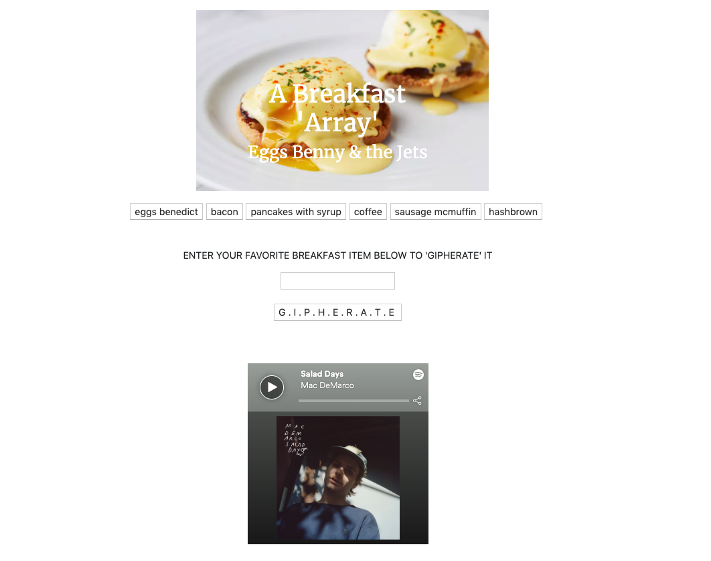
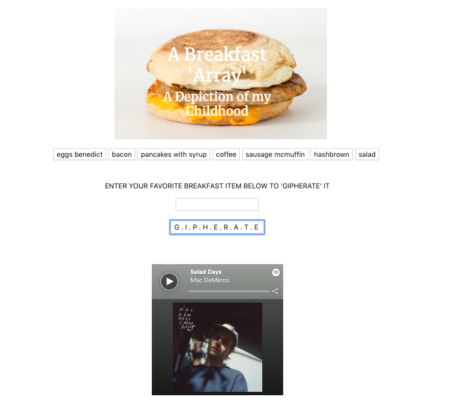
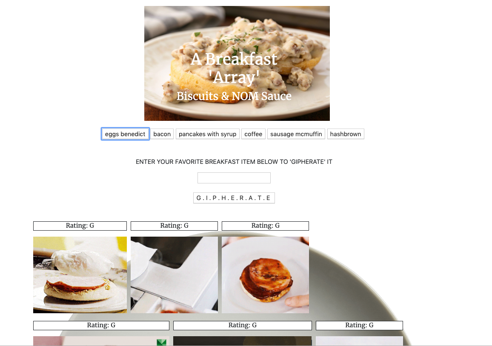
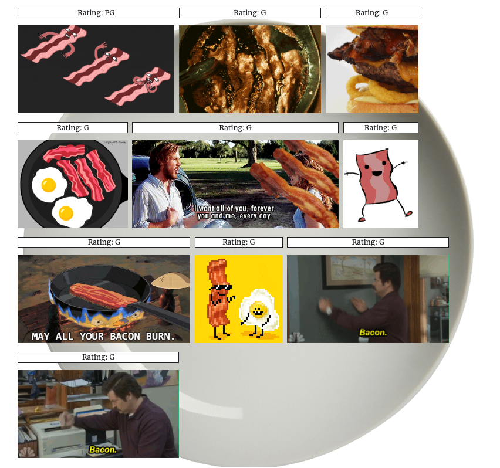

# A Breakfast 'Array'

This is my submission for homework assignment number 6: GifTastic. We were tasked with creating a website that utilized data from the GIPHY API and stored in on your page based on user input & user interaction. When the page loads, buttons that I dynamically created in JavaScript append to the page and are represenative of some of my favorite breakfast items. The user is invited to input their own favorite breakfast item which in then also appended to the page as a button. Once the button is clicked, the top ten GIFs from the GIPHY API are then appended to the page where the user can interact with them by making them animate upon clicking the GIF. These GIFs are displayed upon a background image of a plate that appears when a user interacts with a button. If they click on the GIF again, it goes back to a still image. In order to accomplish this, we had to use our recent understanding of jQuery, APIs, JavaScript, Bootstrap, HTML, & CSS. The design for my website is simple. I appreciate the clean & easy aesthetics. 

Tech I Used:

[HTML](https://www.w3schools.com/html/)

[Bootstrap](https://getbootstrap.com/docs/4.3/getting-started/introduction/)

[API](https://en.wikipedia.org/wiki/Application_programming_interface)

[CSS](https://www.w3schools.com/css/)

[JavaScript](https://www.w3schools.com/js/)

[jQuery](https://www.w3schools.com/jquery/)

Author: [Matthew Hagarty](https://github.com/matthewryanhagarty)